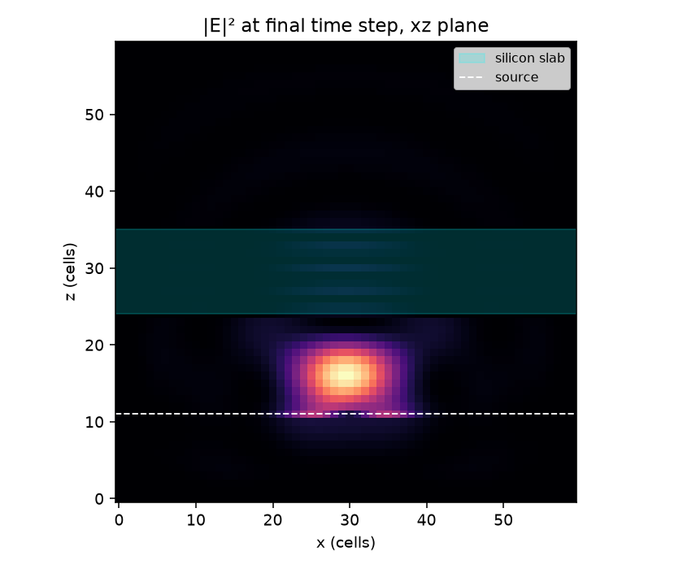

# fdtdx-notes

Working through [FDTDX](https://github.com/ymahlau/fdtdx) — a JAX framework for differentiable
FDTD electromagnetic simulation — from scratch, one concept at a time.

Each script is standalone and runs on CPU in seconds. Run them in order.

## Setup

```bash
python -m venv .venv
.venv\Scripts\activate          # Linux/macOS: source .venv/bin/activate
python -m pip install fdtdx
```

## Steps

| | |
|---|---|
| [`step1_setup.py`](steps/step1_setup.py) | Objects, constraints, containers. Nothing has a position until `place_objects()` solves for it. |
| [`step2_source_and_materials.py`](steps/step2_source_and_materials.py) | Placing a silicon slab and a Gaussian source by hand, using the constraint language. |
| [`step3_run.py`](steps/step3_run.py) | Propagate light, record a detector, plot the field. |
| [`step4_gradient.py`](steps/step4_gradient.py) | Compute a gradient — and check it against finite differences. |

## Step 3 output

A Gaussian beam launched below a silicon slab, at the final time step:



The horizontal fringes inside the slab are a standing wave. They sit λ/2 apart, and λ shrinks by
the refractive index inside the material — so with n = 3.5 and a 12-cell slab you should count
about 4 bright bands. You do. The bright region below the slab is the ~31% reflection off the
silicon interface interfering with the incident beam.

## Two things that came out of step 4

**The two gradient methods disagree.** On the same setup, `method="reversible"` reports a gradient
in the PML about 10× larger than anything in the interior — at a corner where finite differences
say the true sensitivity is exactly zero. `method="checkpointed"` gives ~0 there and matches finite
differences to ~1% in the interior. That is consistent with how reversible works: it reconstructs
fields by running Maxwell's equations backwards, and the PML is precisely the part that is not
time-reversible. Probably harmless for real optimisation, since you would never optimise PML
voxels — but worth knowing.

**Detector arrays stay float32** even with `jax_enable_x64` and `config.dtype=float64`. Everything
else converts. JAX warns this will become a hard error in a future release. Practical effect: the
loss carries ~7 digits, which puts a ~1% noise floor on any finite-difference check.

## Notes

[`NOTES.md`](NOTES.md) — everything that tripped me up getting this running, mostly on Windows.
The one that cost the most time: the PyPI release and GitHub `main` have different APIs and **both
report version 0.6.2**, so nothing warns you. `hasattr(fdtdx, "UniformGrid")` tells them apart.
